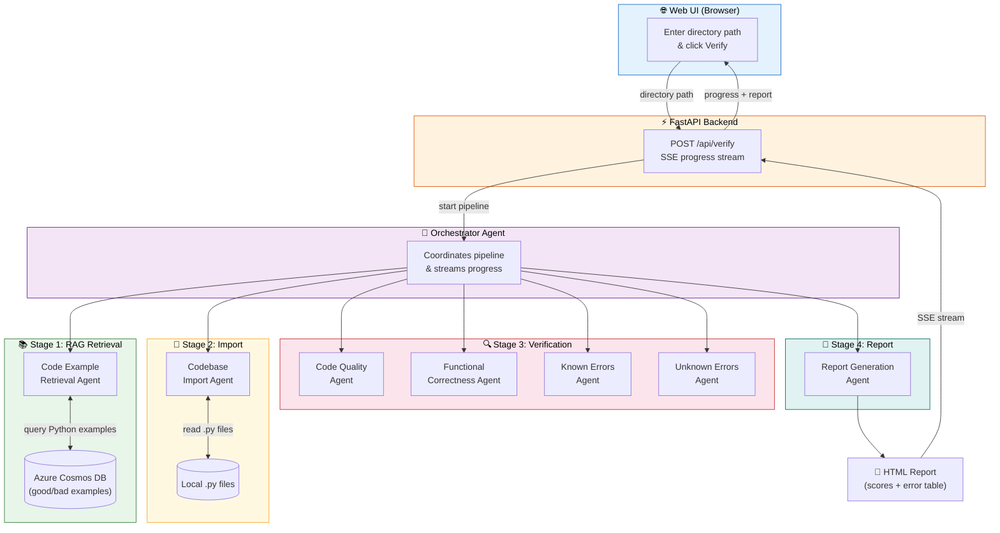

# Opustest — AI-Powered Python Code Verification

[](https://www.python.org/downloads/)
[](LICENSE)
[](https://github.com/microsoft/agent-framework)
[](https://learn.microsoft.com/azure/cosmos-db/)
[](https://learn.microsoft.com/azure/container-apps/)
[](https://fastapi.tiangolo.com/)

---

## What is opustest?

opustest is an **agentic AI system** that automatically analyzes Python codebases and produces a detailed quality report. It uses multiple specialized AI agents — built with [Microsoft Agent Framework](https://github.com/microsoft/agent-framework) — that collaborate in a pipeline to score your code across four areas and flag every issue found.

The system uses **Retrieval-Augmented Generation (RAG)**: before analyzing your code, it retrieves curated examples of good and bad Python code from an **Azure Cosmos DB** database, and uses those examples as the quality standards for its review.

You interact with opustest through a **web-based UI** where you enter a **directory path** to a Python codebase, watch real-time progress updates, and receive an HTML report.

### Who is this for?

- **Developers** who want automated code reviews against consistent standards
- **Teams** looking to enforce coding standards across projects
- **Learners** exploring multi-agent AI systems, RAG patterns, and Azure deployment

### What does the report look like?

The generated HTML report contains:

1. **Scores (0–5)** in four areas, plus a total out of 20:
   - Static Code Quality and Coding Standards
   - Functional Correctness
   - Handling of Known Errors
   - Handling of Unknown Errors
2. **Error table** listing every issue found, with columns:
   - Error Found
   - File
   - Type of Error
   - Explanation (why it was flagged, referencing the RAG database examples)
   - Fix Prompt (a ready-to-use prompt for a coding assistant to fix the issue)

---

## Architecture

The system uses these agents, orchestrated sequentially:

1. **Code Example Retrieval Agent** — Retrieves Python code examples (good/bad) from Azure Cosmos DB via RAG
2. **Codebase Import Agent** — Reads all `.py` files from the user-specified directory
3. **Verification Agents** (one per scoring area):
   - Code Quality and Coding Standards (score 0–5)
   - Functional Correctness (score 0–5)
   - Handling of Known Errors (score 0–5)
   - Handling of Unknown Errors (score 0–5)
4. **Report Generation Agent** — Produces an HTML report with scores and an error table

An **Orchestrator** coordinates the pipeline and streams progress updates to the web UI via SSE.

### How it works (step by step)



1. You enter a **directory path** to a Python codebase in the **Web UI** and click **Verify Codebase**
2. The **Orchestrator** starts the pipeline and streams progress back to the browser via Server-Sent Events (SSE)
3. The **Code Example Retrieval Agent** queries Cosmos DB for Python examples (good and bad)
4. The **Codebase Import Agent** reads all `.py` files from the directory
5. Four **Verification Agents** each score one area (0–5) and list issues found
6. The **Report Generation Agent** compiles everything into an HTML report
7. The report is displayed in the Web UI

### Project structure

```
opustest/
├── backend/
│   ├── agents/
│   │   ├── code_example_retrieval.py   # RAG retrieval from Cosmos DB
│   │   ├── codebase_import.py          # Reads .py files from directory
│   │   ├── orchestrator.py             # Coordinates the full pipeline
│   │   ├── report_generation.py        # Generates the HTML report
│   │   └── verification/
│   │       ├── code_quality.py         # Score: code quality & standards
│   │       ├── functional_correctness.py # Score: functional correctness
│   │       ├── known_errors.py         # Score: known error handling
│   │       └── unknown_errors.py       # Score: unknown error handling
│   ├── app.py                          # FastAPI server with SSE
│   ├── config.py                       # Environment variable loading
│   ├── cosmos_client.py                # Cosmos DB query functions
│   └── git_utils.py                    # Git repo cloning for cloud mode
├── frontend/
│   ├── index.html                      # Web UI
│   ├── styles.css                      # Styling
│   └── app.js                          # SSE client & progress display
├── infra/
│   ├── main.bicep                      # Azure infra entry point
│   ├── main.parameters.json            # azd parameter bindings
│   └── modules/
│       ├── acr.bicep                   # Azure Container Registry
│       ├── container-app.bicep         # Container Apps Environment + App
│       └── cosmos.bicep                # Cosmos DB account, database, container
├── scripts/
│   ├── deploy.ps1                      # One-command deploy (PowerShell)
│   ├── deploy.sh                       # One-command deploy (Bash)
│   ├── postprovision.ps1               # azd hook: seeds Cosmos DB after provision (Windows)
│   ├── postprovision.sh                # azd hook: seeds Cosmos DB after provision (Linux/macOS)
│   └── seed_cosmos.py                  # Populate sample code examples
├── azure.yaml                          # azd project definition
├── Dockerfile                          # Container image definition
├── requirements.txt                    # Python dependencies
└── .env.example                        # Template for environment variables
```

---

## Cosmos DB Schema

Each document in the code examples container has:

| Field         | Description                                      |
|---------------|--------------------------------------------------|
| `type`        | `"good"` or `"bad"`                              |
| `language`    | Programming language (only Python examples used)  |
| `severity`    | `"low"`, `"medium"`, or `"high"`                 |
| `description` | Explanation of what is good or bad                |
| `code`        | The example code snippet                          |

---

## Getting Started

There are two ways to run opustest: **locally** (for development) or **deployed to Azure Container Apps** (for production). Both paths are covered below.

### Prerequisites

You will need:

| Tool | Purpose | Install link |
|------|---------|-------------|
| **Python 3.10+** | Run the backend and seed script | [python.org](https://www.python.org/downloads/) |
| **Azure CLI** (`az`) | Authenticate and manage Azure resources | [Install Azure CLI](https://learn.microsoft.com/cli/azure/install-azure-cli) |
| **Azure Developer CLI** (`azd`) | Provision infrastructure from Bicep | [Install azd](https://learn.microsoft.com/azure/developer/azure-developer-cli/install-azd) |
| **Docker** | Build container images (cloud deploy only) | [Get Docker](https://docs.docker.com/get-docker/) |

You will also need:
- An **Azure OpenAI** deployment with the Responses API enabled
- An **Azure subscription** (for Cosmos DB and Container Apps)

---

### Option A: Run Locally

Follow these steps to run opustest on your machine.

**Step 1 — Clone and configure environment variables**

```bash
git clone <your-repo-url>
cd opustest
cp .env.example .env
```

Open `.env` in a text editor and fill in your values:

```
AZURE_AI_PROJECT_ENDPOINT=https://<your-project>.openai.azure.com/
AZURE_AI_MODEL_DEPLOYMENT_NAME=gpt-4o
COSMOS_ENDPOINT=https://<your-account>.documents.azure.com:443/
COSMOS_KEY=<your-cosmos-key>
COSMOS_DATABASE_NAME=code-examples
COSMOS_CONTAINER_NAME=examples
```

> **Where do these values come from?** `AZURE_AI_PROJECT_ENDPOINT` and `AZURE_AI_MODEL_DEPLOYMENT_NAME` come from your Azure OpenAI resource. The Cosmos values come from provisioning (Step 3) or from an existing Cosmos DB account.

**Step 2 — Install Python dependencies**

```bash
pip install --pre -r requirements.txt
```

> The `--pre` flag is required because Microsoft Agent Framework is currently in preview.

**Step 3 — Provision Cosmos DB and seed sample data**

```bash
# Log in to Azure
az login
azd auth login

# Provision the Cosmos DB account, database, and container
azd provision

# Retrieve the Cosmos DB key and add it to your .env
az cosmosdb keys list \
    --name <COSMOS_ACCOUNT_NAME> \
    --resource-group <AZURE_RESOURCE_GROUP> \
    --query primaryMasterKey -o tsv
```

After provisioning, `azd` makes these outputs available:

| Output                 | Description                        |
|------------------------|------------------------------------|
| `COSMOS_ENDPOINT`      | Cosmos DB account endpoint URL     |
| `COSMOS_ACCOUNT_NAME`  | Cosmos DB account name             |
| `COSMOS_DATABASE_NAME` | Database name (`code-examples`)    |
| `COSMOS_CONTAINER_NAME`| Container name (`examples`)        |

Now populate the database with sample good/bad Python code examples:

```bash
python scripts/seed_cosmos.py
```

The script creates 19 sample documents:
- **Good Python examples** (8): PEP 8 naming, type hints, specific exception handling, context managers, input validation, defensive programming with logging
- **Bad Python examples** (9): bare except, poor naming, missing error handling, SQL injection, mutable defaults, swallowed exceptions, inconsistent return types
- **Non-Python examples** (2): one JavaScript and one Java entry that the RAG filter correctly ignores

> **Tip:** When you deploy to Azure with `azd up`, the seed script runs automatically via the `postprovision` hook — you don't need to run it manually.

**Step 4 — Start the server**

```bash
uvicorn backend.app:app --reload
```

**Step 5 — Use the app**

Open [http://localhost:8000](http://localhost:8000) in your browser.

Enter the absolute path to a Python codebase directory (e.g. `C:\Users\you\my-project` or `/home/you/my-project`) and click **Verify Codebase**.

You will see real-time progress updates for each stage, and the final HTML report will be displayed when complete.

---

### Option B: Deploy to Azure Container Apps

The recommended way to deploy is with `azd up`, which provisions all Azure resources, builds the Docker image, pushes it to ACR, deploys to Container Apps, and **automatically seeds Cosmos DB** with sample data via the `postprovision` hook.

#### Quick deploy with azd

```bash
# Log in to Azure
az login
azd auth login

# Set required environment variables
azd init
azd env set AZURE_AI_PROJECT_ENDPOINT "https://<your-project>.openai.azure.com/"
azd env set AZURE_AI_MODEL_DEPLOYMENT_NAME "gpt-4o"

# Provision, build, and deploy (seeds Cosmos DB automatically)
azd up
```

After deployment completes, `azd` prints the application URL.

Alternatively, you can use the one-command deploy scripts:

#### One-command deploy (PowerShell)

```powershell
.\scripts\deploy.ps1 `
    -EnvironmentName codeverify `
    -Location eastus `
    -AzureAiProjectEndpoint "https://<your-project>.openai.azure.com/"
```

#### One-command deploy (Bash)

```bash
chmod +x scripts/deploy.sh
./scripts/deploy.sh \
    --env-name codeverify \
    --location eastus \
    --ai-endpoint "https://<your-project>.openai.azure.com/"
```

#### What the script does

1. Initialises an `azd` environment with your settings
2. Provisions all Azure resources via Bicep (Cosmos DB, ACR, Container Apps)
3. Builds the Docker image and pushes it to ACR
4. Updates the Container App with the new image
5. Seeds Cosmos DB with sample code examples (pass `-SkipSeed` / `--skip-seed` to skip)
6. Prints the application URL

#### Redeploying after code changes

```bash
docker build -t code-verification:latest .
docker tag code-verification:latest <ACR_LOGIN_SERVER>/code-verification:latest
docker push <ACR_LOGIN_SERVER>/code-verification:latest
az containerapp update --name <APP_NAME> --resource-group <RG_NAME> --image <ACR_LOGIN_SERVER>/code-verification:latest
```

#### Local Docker run (without full Azure deploy)

```bash
docker build -t code-verification .
docker run -p 8000:8000 --env-file .env code-verification
```

---

## Scoring Rubrics

Each area is scored from 0 (worst) to 5 (best). The total score is the sum of all four areas (max 20).

<details>
<summary><strong>Code Quality and Coding Standards</strong></summary>

| Score | Meaning |
|-------|---------|
| 0 | Code fails linting or contains syntax errors |
| 1 | Major formatting issues; inconsistent naming; poor structure |
| 2 | Passes basic linting but contains frequent style violations |
| 3 | Mostly compliant with coding standards; minor issues |
| 4 | Fully compliant with coding standards; clean and consistent structure |
| 5 | Fully compliant, idiomatic, and optimized for readability |

</details>

<details>
<summary><strong>Functional Correctness</strong></summary>

| Score | Meaning |
|-------|---------|
| 0 | Core functionality is broken or produces incorrect results |
| 1 | Major features malfunction; incorrect behavior is common |
| 2 | Basic functionality works, but edge cases frequently fail |
| 3 | Core functionality works as intended; minor bugs exist |
| 4 | Functionality is correct across typical and edge cases |
| 5 | Functionality is fully correct and robust across all expected scenarios |

</details>

<details>
<summary><strong>Handling of Known Errors</strong></summary>

| Score | Meaning |
|-------|---------|
| 0 | Known error conditions are not handled and cause crashes or undefined behavior |
| 1 | Minimal error handling; many known errors propagate unhandled |
| 2 | Some known errors are handled, but coverage is inconsistent |
| 3 | Most known error cases are handled with reasonable safeguards |
| 4 | All known error conditions are explicitly handled with clear recovery or messaging |
| 5 | Known errors are comprehensively handled with graceful recovery and clear diagnostics |

</details>

<details>
<summary><strong>Handling of Unknown Errors</strong></summary>

| Score | Meaning |
|-------|---------|
| 0 | Unexpected errors cause crashes, data corruption, or undefined behavior |
| 1 | Global error handling exists but provides little protection or visibility |
| 2 | Some safeguards exist, but unexpected failures are not consistently contained |
| 3 | Unexpected errors are generally contained and logged without crashing the system |
| 4 | Robust fallback mechanisms prevent most unknown errors from causing failures |
| 5 | System is resilient to unknown errors through defensive programming and comprehensive logging |

</details>

---

## Contributing

Contributions are welcome. Please open an issue to discuss proposed changes before submitting a pull request.

## License

This project is licensed under the [MIT License](LICENSE).
